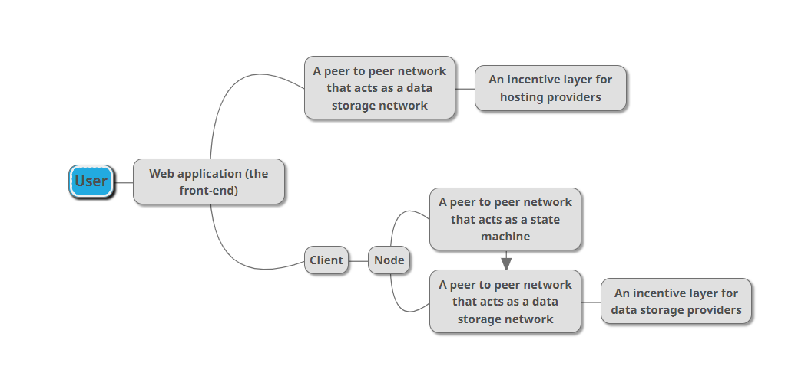

## Introduction

With the growing popularity of blockchain technologies, a decentralized web is one of the things that are currently in demand, however, there are many misconceptions about blockchain-powered decentralized web applications. So in this document, though not a fan of the web, I will propose a structure for these decentralized web applications (or DWAs - an acronym that I made up) powered by the blockchain technology.

Note: This article would require you to have a basic understanding of blockchain. 

## Misconceptions

There are tons of things that people get wrong in this space, but I will address ones that are detrimental in my opinion.

Using blockchain networks will not automatically grant you decentralization. It is heavily dependent on how you develop the app and other problems related to web hosting and nodes.

With nodes, people are using node providers and don't run their own nodes, they often use something like Metamask with its default setting, which connects to Infura - a node provider. This basically means that you are centralized to that node provider. So the thing we can get out of this is that we must run our own node, or have a wallet/client that has a node built-in.

With web hosting, many inexperienced developers (or people who don't care about decentralization when still using the blockchain technology) use centralized web hosting providers, basically granting all the power to those providers.

## The idea

Let's actually move on to the structure itself, it will look something like this:

### Hosting

You will host your web app on "a peer to peer network that acts as a data storage network", the most popular existing one is probably IPFS, but the problem is that the site might be lost, this problem is due to IPFS being 100% voluntary, nodes can decide to store your data or not. To ensure that everything is working properly, an incentive layer for hosting providers should be added. This is basically the first utility of the blockchain technology - helps create a data storage marketplace between developers and hosting providers. 

Existing blockchain networks that provide such functionality are Siacoin, Filecoin, Storj, Arweave, etc.

### Front-end

It will mostly be similar to traditional front-ends, but you would normally have to learn how to use a library to interact with blockchain networks. For Ethereum, there are `web3.js` and `ethers.js`.

### Logic

Traditional centralized web applications work by having the front-end send requests to the back-end which is essentially just a server.

Our DWAs will work by treating every interaction in the front-end as transactions triggering smart contracts on blockchain networks. The app will connect to a client (or a wallet as mostly seen nowadays) and that client will interact with the node. The node will then send broadcast the transaction to others in the network. When finality is achieved, the state is changed.

Choosing a blockchain network actually plays a huge role in creating the application, because it will determine decentralization. A good network for handling logics is Ethereum, it is arguably one of the most decentralized and mature blockchain networks out there with really good supports. When this article was being written, networks like Solana, Tron, EOS, Avalanche, Polkadot, and many other modern blockchain networks are centralized, I will just leave this here for now, hopefully I can talk about why they are in another article.

### Data storage

Handling logics on smart contracts is totally okay, but things sure get tricky when it comes to data storage. The main problem is that data price is too expensive when you want to store data on-chain. At the time of writing, to store only 1KB worth of data, you would need about 0.032ETH or *64 USD*, which is just straight-up ridiculous.

The solution is pretty easy, it is the same as how we do decentralized web hosting. We can either use something like IPFS, or preferably, blockchain networks like Siacoin.

From this, the smart contract only has to hold a hash or an URL to the data which is really cheap to store.

### Not using blockchains

Do we actually need to use blockchain networks?

For me, that's a no and a yes. You don't need blockchains when building applications like a social network app or a chatting app. However, normally, you would have to download their own clients, which doesn't really make sense when using the web, you should just create an app that runs on the machine itself then. Of course, with blockchain-based applications, you would still have to download a node client, but *you only need one client for all applications, not one client for one app.*

Furthermore, as mentioned above, to have proper decentralized web hosting, you need an incentive layer, which is achievable through a blockchain network.

Another thing with blockchains is that they provide consensus, so with something agreement-needed like a finance app, you would need blockchains.

## UX

We are building things for normal users, so let's actually talk about UX.

The given structure should work fine technologically, but when it comes to real-world UX, it is not okay.

The first bottleneck must be gas fees, you basically have to pay a few cents to tens of dollars just to use the app, which is expensive and not normally seen in traditional applications. This also leads to the lack of general applications, when finance-related apps would only be the ones that make the most sense. Blockchain networks' speed is also pretty slow, and you also have to stick with a popped up wallet/client mostly every time, which are annoying.

Another problem is that running nodes might not be pleasant for non-tech guys, hopefully they will be easily accessible in browsers in the future.

## Conclusion

Overall, I have proposed a structure for DWAs, or decentralized web applications using the blockchain technology. It is nowhere near "good", but somewhat workable, and more specific than a term like "web3". Hopefully one day a better solution to implement decentralized web applications can be thought of, or a better innovation can be thought of to replace/change the web entirely.

That's all, thanks for reading! 
